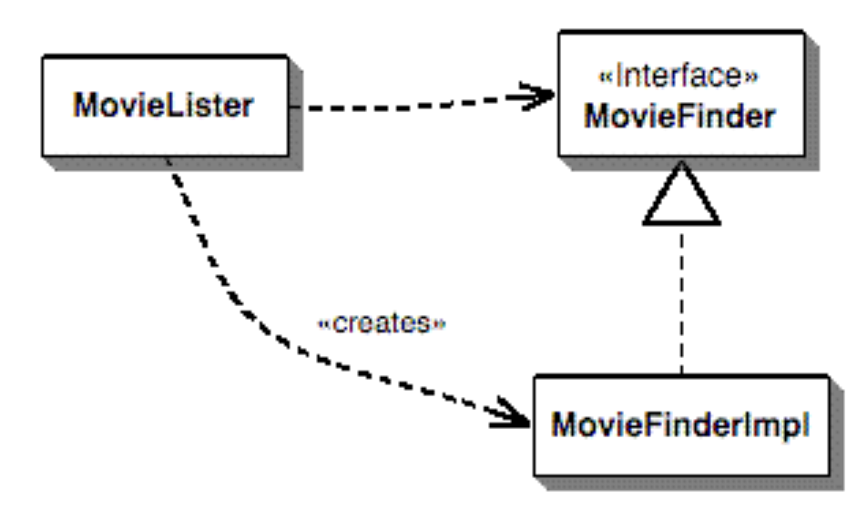

# [Inversion of Control Containers and the Dependency Injection pattern](https://martinfowler.com/articles/injection.html)

### Problem

- Fitting together web controller architecture with database interface backing when they were built by different teams with little knowledge of each other

### Components and services

- Definitions
    - Component
        - Software that's intended to be used, without change, by an application that is out of the control of the writers of the component
        - Without change meaning that the application doesn't change the source code of the components, though they may extend upon the behaviors of the component
    - Service
        - Similar to a component in that it's used by foreign applications
        - Used remotely through some remote interface, either synchronous or asynchronous

### Naive example

    public interface MovieFinder {
    List findAll();
    }

    class MovieLister...

    private MovieFinder finder;
    public MovieLister() {
    finder = new ColonDelimitedMovieFinder("movies1.txt");
    }

    public Movie[] moviesDirectedBy(String arg) {
    List allMovies = finder.findAll();
    for (Iterator it = allMovies.iterator(); it.hasNext();) {
    Movie movie = (Movie) it.next();
    if (!movie.getDirector().equals(arg)) it.remove();
    }
    return (Movie[]) allMovies.toArray(new Movie[allMovies.size()]);
    }

- The interface for the finder is well decoupled
- moviesDirectedBy is tightly coupled with how movies are being stored, in this case through the finder
    - This becomes a problem if other people also want to use your movie finder but instead of storing their movie listings in a colon delimited file called "movies1.txt", they use something else like SQL or XML
    - Then, we need a different class to grab that data

    

- Based on the above figure, the question is how do you make it so that the lister class is ignorant of the implementation class but can still talk to an instance to do its work
    - In real systems, you can abstract the use of components by talking to them through an interface.
    - But deploying the system in different ways would require plugins to handle the interaction with these services so they can use different implementations
    - These plugins for an application are assembled through inversion of control

### Inversion of control

- Common characteristic of frameworks
- What aspect of control are you inverting?
    - For this new breed of containers, the inversion is how they lookup a plugin implementation
        - In the naive example, the lister looked up the finder implementation by directly instantiating it which stops it from being a plugin
- The approach
    - Ensure that any user of a plugin follows some convention that allows a separate assembler module to inject the implementation into the lister
- New name
    - IoC is too generic
    - The general consensus now is *Dependency Injection*

### Forms of dependency injection
