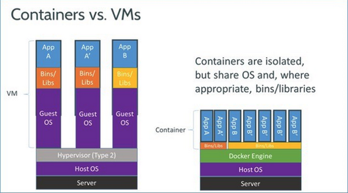

# [What is Docker?](https://www.quora.com/What-is-Docker-Please-explain-it-in-simple-terms)

- Background
    - Say you need to build an application. You need somewhere to host that application
        - You can set up a dedicated server or run your application onto a hosting company
    - But then Amazon and cloud computing comes in
        - More cost efficient since you're only paying for the services you use
        - Optimized performance
    - But cloud computing has its drawbacks too
        - Heavy system usage
            - Windows, Mac, and Linux can take up a lot of virtual memory - around 1 GB
    - How does Docker fix this?

        

        - As you can see, instead of using an entirely new operating system for each application, resources are shared among multiple applications
        - Having this extra layer of abstraction optimizes resource usage and reduces redundancy in operating systems
    - So how would someone utilizing Docker benefit from all this?
        - Faster application deployment
        - Faster application undeployment
        - Faster application starts
        - Faster application stops
        - Faster processes just in general
