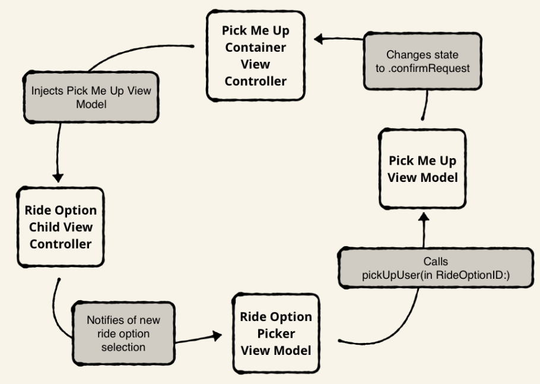
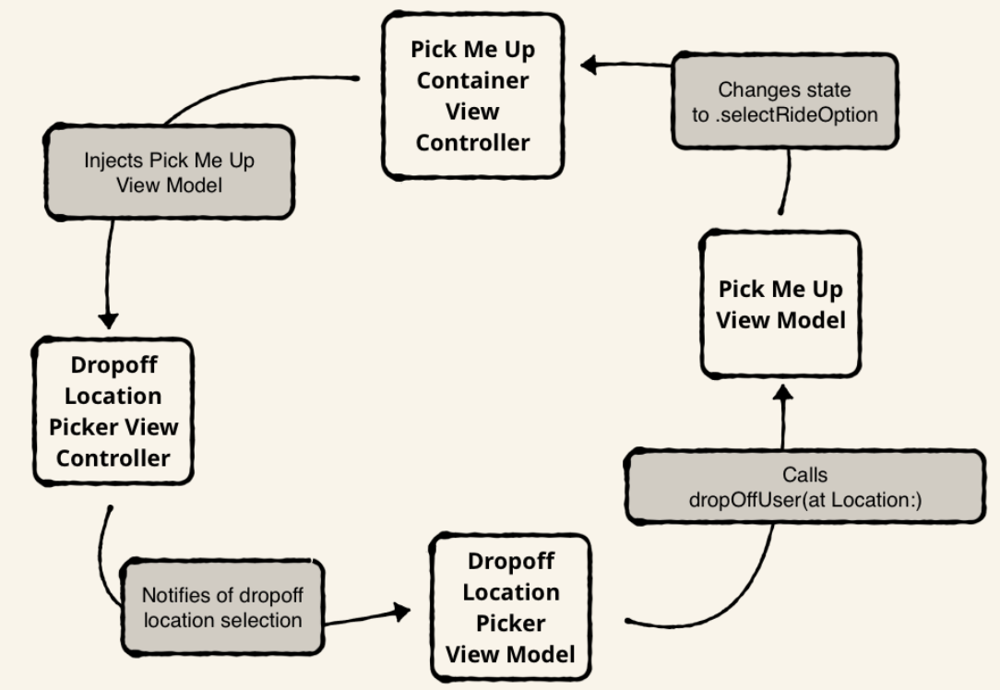

# [Advanced iOS App Architecture](https://store.raywenderlich.com/products/advanced-ios-app-architecture)

### Chapter 2: Which architecture is right for me

- Good architecture helps improve team velocity and fragile code quality, as well as preventing rigid software
- There are 2 fundamental causes for bad architecture: highly interdependent code and large types
    - Highly interdependent code: code in one type reaches out to other concrete types. One part of your code depends on another
    - Large types: Classes, structs, protocols, and enums that have long public interfaces due to many public methods or properties
- Class implementations should not be too long. Think about it this way: if a new engineer comes in tomorrow and needs to understand what 1 view controller does, what percentage of the app's codebase does the new developer need to understand?
- The more objects that depend on the global state, the less information a developer will have when reading a single file
- Today's world is agile and developers are constantly making changes to codebases so having an architecture that is resilient to change is very important
- To reduce interdependency in codebases, limit object dependencies and make the required dependencies obvious
- Making code reusable, even if you don't need to use it more than once, is good because it helps when shuffling code around and reduces the risk of refactors
- Compile and build times are also dependent on good architecture. Since Swift doesn't use header files, every time a change is made to a file, it has to read through all the Swift files in the entire module again when compiling. By breaking up your project into different modules, unedited modules don't have to be recompiled which speeds up build times
- Good architecture allows you to break user stories into tasks - different kinds of objects needed to build that new feature
- Migrating code from one technology to another is much easier with good architecture since high level types won't be coupled with lower level system implementations ie migrating from NSURLConnection pre iOs7 to NSURLSession post
- Being locked with a specific type of data format is also a problem.
- Since many teams use data driven and lean approaches to app dev - feature flags to A/B test features and to toggle off unfinished features, good architecture makes incorporating feature flags flexible
- UIKit is designed with MVC so starting with MVC is good. You can scale up after
- Clean architecture and ports & adapters are concepts that are high level and abstract but will help in tweaking derived patterns. VIPER and RIBs(uber's take on VIPER) are both derived. Good for apps that have a lot of business logic, not so much presentation heavy
- Unidirectional architecture are all about reactive UIs and state management. Redux(the most used uni pattern), MVI, Flux, RxFeedback are all examples. The one drawback is that most components are interconnected and inflexible
- Elements is a collection of smaller architecture patterns designed to be independent so you can use multiple architecture patterns flexibly.
- General best practices
    - Make sure to have cohesive types - properties and methods that make up a type should have focused responsibilities
    - Multi module apps
    - Loosely coupled parts
    - Managing object dependencies using patterns like dependency injection containers and service locators

### Chapter 4: Objects and Their Dependencies

- Good dependency techniques have these qualities
    - Maintainability: Changing one part of the code base doesn't adversely affect others
    - Testability: Unit and UI tests don't rely on factors you can't control such as the network
    - Substitutability: Able to substitute the current implementation at compile time and runtime. Useful for A/B testing
    - Deferability: Able to defer big decisions - selecting a database
    - Parallel work streams: Different members able to work independently on the same feature without interrupting each other
    - Control during development: Allows developers to quickly iterate by controlling build behavior - sign in would use a fake in memory credential store for testing
    - Minimizing object lifetimes: Developers have to manage less states and makes the app more predictable
    - Reusability: Components can be reused
- Definitions
    - A dependency is an object that another object depends on to work
    - A transitive dependency is the dependency that another dependency depends on
    - The object under construction is the object that depends on the dependency
    - The consumer uses the object under construction
    - These relationships form an object graph
- How do dependencies arise?
    - Refactoring a large class such that it becomes many smaller classes
    - Removing duplicate code
    - Controlling side effects
- Fundamental considerations
    - How will the object under construction get the dependency?
        - From the inside: Global property or instantiation(if it has the same lifetime as the object under construction)
        - From the outside: Initializer argument(passing the dependency as an argument), mutable stored property(setting a property in the object), method
    - Dependency patterns
        - Dependency injection: Provide all dependencies outside the object under construction
        - Service locator: An object used to create and hold onto dependencies. The object would use service locator to make a dependency it needs
        - Environment: Mutable struct that provides all dependencies needed
        - Protocol Extension
    - Dependency Injection
        - Externalizes dependencies to allow control of dependencies outside of the object under construction
        - Types of injection
            - Initializer: Dependencies are passed as a parameter. Best injection type because the dependency can then be stored as an immutable stored property
            - Property: After the OUC(Obj under const) is initialized, the consumer provides a dependency to the OUC by setting a stored property
            - Method: Consumer provides dependencies to the OUC when the OUC calls a method in the consumer. Good if the OUC doesn't need to persist the dependency. Minimizes object lifetimes, which is a good dependency technique mentioned earlier
        - Pairing dependency injection along with protocol types enables substitutability when testing fake types
        - You can conditionally compile code through adding compilation condition identifiers to Xcode's active compilation conditions build setting
        - Runtime substitution can be achieved through wrapping dependency initializations around an if else and setting based on the condition premise
- Dependency injection approaches
    - Quick overview
        - On demand: Creating dependency graphs when needed in a decentralized manner
        - Factories: Centralize initialization logic
        - Single container: Batches all initialization logic into 1 container
        - Container hierarchy: Breaks the big container into smaller containers
    - On demand
        - Consumer creates or finds the dependencies needed by the OUC at the time the consumer instantiates the OUC
        - Ephemeral dependencies are created and destroyed alongside the OUC. Best used if dependencies don't need to live longer than the OUC
        - A reference is created or found to a dependency if it needs to live longer than the OUC
        - Pros
            - Testable since dependencies are easily substitutable since dependencies are wrapped around if else instantiation clauses
            - Deferability: ie start with a memory data store and when you need to switch to a database, replace all instances of in memory instantiations - albeit tedious
            - Parallel work streams
        - Cons
            - Decentralized: same initialization logic is duplicated many times
            - Consumers need to know how to build the entire dependency graph for an OUC: this could result in many dependencies being instantiated and there will probably be multiple consumers using the same OUC, which is duplicating logic
    - Factories
        - Made up of factory methods that can create dependencies and OUCs
        - No state - no stored properties
        - Dependency factory method: create a new dependency instance
            - For an ephemeral transitive dependency: Calls on another dependency factory included in the factories class
            - To get a reference to a long lived transitive dependency: Include a parameter when calling the dependency
            - Typically have a protocol return type to enable substitutability
            - Encapsulates the mapping between protocol and concrete types through resolution
        - OUC factory methods
            - Creates the dependency graph needed to instantiate an OUC
            - Called outside of the factories class
        - Some OUCs and dependencies will need runtime factory arguments to function
        - Substituting dependency implementations is similar but better than on demand: you wrap dependency resolutions with a conditional statement once in the factory class and you can use it anywhere
        - The problem with factories is that every time they are called, a new instance is created
            - This is solved in 2 ways
                - Closures
                    - Declare a stored property in the OUC - let a: () → UseCase
                    - Add an initializer parameter to the OUC with the same closure type
                    - Go to the factories class and create a new closure in the OUC factory method that will call a dependency factory method and return the new instance
                    - Pass this as a parameter to the initializer call
                    - Benefits
                        - This is good because the OUC can create as many instances of the factory dependency as it wants without knowing all the transitive dependencies behind the dependency created
                - Protocols
                    - Define a new factory protocol that contains a single method which returns the dependency the OUC needs
                    - Add a stored property and initializer parameter of the protocol type in the OUC
                    - Go back to the factories class and to the OUC's factory method and update the initialization line to inject self.self as the new factory protocol you declared
        - Pros
            - Ephemeral dependencies are created in a central place allowing you to change code in 1 place for all
            - Substitutability since all dependencies are initialized in one class
            - Consumers are more resilient to change since they no longer need to know how to build the dependency graphs
        - Cons
            - A single factory class can become extremely large in a bigger app
            - Only works for ephemeral objects. Long lived objects need to be held somewhere else
    - Single container approach
        - A factories class with stored properties for holding onto long lived dependencies
        - Dependency factory methods
            - For creating an ephemeral transitive dependencies through calling another dependency factory - same as factories approach
            - For reference to a long lived transitive dependency, this approach gets the dependency from a stored property
                - This means there are no parameters for calling a method
        - OUC factory methods
            - Like dependency factory methods, these factory methods don't need any parameters for long lived dependencies which lessens the things consumers have to manage
            - Also abstracts the process since consumers can create OUCs without knowing anything about dependency graphs behind the objects
        - Long lived dependencies can be easily substituted by wrapping their initialization line with a conditional statement
        - Containers should only have 1 instance - singleton
        - Pros
            - Manages the entire app's dependency graph, abstracting the need for other code to know how to build object graphs
            - The container itself manages the singleton
            - Code is centralized so dependency graphs are changed within the class
        - Cons
            - Can result in massive container class
    - Container hierarchy approach
        - Some issues that arise in the single container approach is that as more features are added to a product, more dependencies are added. There will be a lot of optional conditional unwrapping. Consumers could have access to reusable dependencies when a user isn't signed in
        - Object scopes
            - Scopes help create and destroy objects by defining a lifetime
            - App scope
                - Created at app launch and destroyed when app is killed
                - Authentication stores, analytics trackers, logging systems
            - User Scope
                - Created when user signs in and destroyed when user signs out
                - Remote APIs and data stores
            - Feature scope
                - Created when the user navigates to a certain feature and destroyed when the user navigates away
                - Uber pick me up feature - location is fetched once and then not retrieved again
                - Interaction scope
                    - Created when a gesture is recognized and destroyed when the gesture ends - short lived scope
        - Every scope should have a container class
        - Designing a container hierarchy
            - Rule: A child container can ask for the dependencies from its parent container all the way to the root container but the parent container cannot ask for a dependency from the child container
                - Reason: A parent container lives longer than a child container so there could be a call where the child container might not exist anymore
            - Child containers need to be provided with parents containers with initializer injection
            - Capturing data
                - A container can capture data model values by converting mutable values to immutable values
                - Makes the code more deterministic because there is no need to consider a change in the captured value. New values will just replace the captured value
            - Pros
                - Scoping allows dependencies that aren't singletons to exist
                - Mutable values can be converted into immutable values
            - Cons
                - More complex
                - Complex apps can end up with long container classes
- Applying DI theory to iOS Apps
    - Since Cocoa touch is an object oriented SDK, every iOS app consists of an object graph at runtime
        - The instance of UIApplication is the root of an app's object graph
            - In particular, the UIApplicationDelegate, the child of UIApplication, is the main entry point for iOS apps
    - Koober object graph
        - Authentication object graph
            - UserSessionRespository's dependency graph
                - AuthRemoteAPI
                    - Networking side
                    - Implementations of this protocol are responsible for talking to Koober's cloud services to sign in and sign up users
                    - Koober Cloud returns a token for successful authentication attempts
                - UserSessionCoding
                    - Implementations of this should encode a UserSession object into Data and decode Data into a UserSession object
                - UserSessionDataStore
                    - Implementations store a user session for a signed in user
                    - Can be stored in Keychain, files, and other places
                - UserSessionRepository
                    - CRUD protocol for managing user sessions
                    - Stateful - lives as long as the app
        - LaunchViewController's dependency graph
            - NotSignedInResponder
                - User authentication protocol
                - Called when a user is not signed in
                - MainViewModel implements this
            - SignedInResponder
                - User auth protocol
                - Called when objects determine a user is signed in
                - MainViewModel implements this
            - LaunchViewModel
                - Holds UI state for a LaunchViewController
                - Ephemeral dependency since app only ever cold starts once in its lifetime
            - LaunchViewController
                - Looks for a signed in user and presents a splash screen
                - Depends on LaunchViewModel to search
        - OnBoardingViewController's dependency graph
            - OnboardingViewModel
                - Holds UI state for an OnBoardingViewController
                - Long lived dependency even while the user is signed out
            - OnBoardingViewController
                - If user is not signed in, MainViewController presents this
                - Container view with life time as long as the user is not signed in
                - Responsible for navigation between welcome, sign up, and sign in screens
            - GoToSignUpNavigator
                - UI navigation protocol
                - Implementor responsible for taking the user to the sign up screen
                - OnBoardingViewModel implements this
            - GoToSignInNavigator
                - UI navigation protocol
                - Takes user to the sign in screen
                - OnBoardingViewModel implements this
            - WelcomeViewModel
                - Holds UI state for a WelcomeViewController
            - WelcomeViewController
                - Renders a welcome screen from which users can navigate to either the sign in or sign up screen
            - SignInViewModel
                - Holds UI state for SignInViewController
            - SignInViewController
                - Users sign in to Koober in this view controller
            - SignUpViewModel
                - Holds UI state for SignUpViewController
            - SignUpViewController
                - Users sign up to Koober in this view controller
        - MainViewController's dependency graph
            - MainViewModel
                - Holds UI state for MainViewController
                - Stateful
            - MainViewController
                - Koober's root view controller
                - Container view controller that manages top level navigation
- Applying the on-demand approach
    - Instantiating MainViewController
        - Initializer method signature takes a MainViewModel and LaunchViewController as dependencies
            - MainViewModel has no parameters so it is easy to instantiate
                - let mainViewModel = MainViewModel()
            - LaunchViewController has a LaunchViewModel as a parameter
                - A LaunchViewModel has a UserSessionRepository, NotSignedInResponder, and SignedInResponder as dependencies
                - Insight
                    - Decomposing large objects into single responsibility objects result in deep object graphs
                    - Thus, the on-demand approach is not practical for real world apps that have large and deep object graphs
                - Creating a UserSessionRepository
                    - Koober resolves this protocol through an implementation named KooberUserSessionRepository
                        - Stateful - create this object once so all OUCs can use the same instance
                        - Set up as a global constant
                        - Takes in a UserSessionDataStore and AuthRemoteAPI implementation as initialization parameters
    - Creating the MainViewController
        - The UserSessionRepository is the only shared instance needed to create this
        - MainViewModel acts as the NotSignedInResponder and SignedInResponder for LaunchViewModel's initializing parameters
        - LaunchViewController is created by taking in the LaunchViewModel as a parameter
        - Then, both MainViewModel and LaunchViewController are passed in as parameters to MainViewController's initializer
    - Creating an OnBoardingViewController
        - Needs an OnBoardingViewModel, WelcomeViewController, SignInViewController, and SignUpViewController as parameters
        - OnBoardingViewModel
            - Created with no initialization parameters
        - WelcomeViewController
            - Needs a WelcomeViewModel to initialize
                - WelcomeViewModel
                    - Needs a SignUpNavigator and SignInNavigator
                    - OnBoardingViewModel is passed in to fulfill both these parameters
        - SignInViewController
            - Needs a SignInViewModel
            - SignInViewModel
                - Needs a UserSessionRepository and SignedInResponder
                    - UserSessionRepository
                        - Created using the global UserSession constant
                    - SignInResponder
                        - MainViewModel is passed in
        - SignUpViewController
            - Same as SignInViewController but with SignUpViewModel
- Applying the factories approach
    - Creating a shared UserSessionRepository
        - Same as the previous GlobalUserSessionRepository but with object initializations distributed into factory methods, one for each dependency
        - Benefits
            - Hides implementation substitutions
                - Gives more flexibility to change which date store to use by changing one method
    - Creating a simplified MainViewController with the factory approach
        - Creating a MainViewModel in KooberObjectFactories
            - A global constant(can only be initialized once) is created for MainViewModel since MainViewModel is stateful
        - Creating a LaunchViewController
            - The same as on demand but shorter and with more abstraction due to factory methods
            - Since KooberObjectFactories is stateless, it doesn't know that MainViewModel is a long lived dependency and thus can't create a NotSignedIn and SignedInResponder, requiring dependencies to be passed from outside the factory class
    - Benefits
        - Centralizes dependency graph code
        - For creating more ephemeral dependencies, the client implementation would never change, only the factory class would have to
    - Cons
        - For creating more long lived dependencies, both client and factory implementation would have to change.
        - But this problem is solved when upgrading to a container class
    - Creating Koober's MainViewController initializer
        - Adds an extra closure as a parameter to inject when making the onBoardingViewController
        - The closure becomes useful later when creating a new OnBoardingViewController as all MainViewController has to do is invoke the empty argument makeOnBoardingViewController closure property that it was initialized with
        - Thus, MainViewController doesn't have to know anything about the dependency graph needed to create a new OnBoardingViewController
- Applying the single container approach
    - Containers are stateful - holding onto long lived dependencies
    - Factory methods don't need parameters anymore since methods in a container can use other methods inside to create ephemeral dependencies and access stored properties to get long lived dependencies
    - Steps
        - Create and store the shared UserSessionRepository
            - Declare a constant stored property for UserSessionRepository
            - Create factory methods inside the container's initializer since Swift doesn't allow an initializer to call a method on self until all stored properties are initialized
            - The stored property is initialized by the inlined factory methods
        - Creating MainViewController
            - Required objects
                - A shared MainViewModel
                    - Add a constant stored property
                    - MainViewModel doesn't require any parameters to initialize so you can either declare "let sharedMainViewModel = MainViewModel()" at the start or initialize it in the init() method
                - An OnBoardingViewController factory closure
                    - Add an optional stored property for onBoardingViewModel because OnBoardingViewModel is only needed when a user is not signed in
                    - Add factory methods outside init to create the view controller
                    - A new OnBoardingViewController is created every time this method is called but with the same view model instance
                - A LaunchViewController
                    - Add 2 factory methods, makeLaunchViewController and makeLaunchViewModel outside init to create the controller
            - After setting up objects
                - Call the makeLaunchViewController method
                - Create a new closure for onBoardingViewControllerFactory, returning a new OnBoardingViewController every time the closure is called
                - Return a MainViewController with the sharedMainViewModel, launchViewController and factory closure
        - Setting up MainViewController and its entire graph when app starts
            - Create the app container and store it in a constant inside app delegate
            - Create the root object, MainViewController, by invoking the container's makeMainViewController method
            - Great thing about this is that all other dependencies are provided from the outside so no parameters have to be provided to the method and nothing else has to be done
    - Insight
        - All other classes have no idea about the dependency containers
        - Therefore, using DI introduce things into your existing code you might want to get rid of later
- Applying the container hierarchy approach
    - Helps scope containers so you don't have to force unwrap objects
    - KooberOnboardingDependencyContainer
        - The long lived dependencies from the app dependency container are held in the class so factory methods can have easy access to them
        - sharedOnBoardingViewModel is constant and only lives as long as the container, eliminating the optional it previously had
        - The app dependency container is the on boarding container's parent container and provides factory methods needed for the child container to set its long lived dependencies
    - AppDependencyContainer
        - Now, since the onboarding is scoped, the closure method for creating an onBoardingViewController now needs to be updated
            - A new instance of the onboardingDependencyContainer is created and its method makeOnBoardingViewController is returned to the closure
    - AppDelegate
        - Making a MainViewController and its entire graph is still the same as the single container approach.
        - Insight
            - Refactoring a single container into a container hierarchy didn't change the implementing code
- Key points
    - Main benefits of good architecture
        - Testability and maintainability
    - Object graphs are formed by consumers that need OUCs and OUCs that need transitive dependencies
    - Fundamentals of managing object dependencies
        - Accessing dependencies
        - Determining substitutability
        - Designing substitutability
    - Main dependency patterns
        - Dependency injection
        - Service locator
        - Environment and protocol extensions
    - Dependency injection
        - Provides dependencies from outside of objects
        - Types of injection
            - Initializer
            - Property
            - Method
        - Applications
            - On demand
            - Factories
            - Single container
            - Container hierarchy
        - Construct an entire object graph upfront so you know how the flow goes as you're writing the code for it
        - When an OUC needs multiple instances of a dependency, inject a factory closure or inject an object that conforms to a factory protocol

### Chapter 5: Architecture: MVVM

- History
    - Introduced by Microsoft architects in the early 2000s
        - Used to simplify design and development using XAML platforms
    - Prior to MVVM, designers would tightly couple views and business logic by writing view specific code
- Present
    - Today, the way most projects start is that graphic designs are done of the project first and then developers write the code for views
    - MVVM is used in iOs to decouple views from models
        - iOS designers can freely change the user interface and iOS developers won't need to change much business logic
- What is it
    - Reactive architecture
        - View reacts to changes on the view model and view model updates its state based on data from the model

        

    - 3 layers
        - Model
            - Contains data access objects and validation logic
            - Knows how to read and write data
            - Notifies view model when data changes
        - View model
            - Contains the state of the view
            - Contains methods that handle user interaction
            - Reads and writes data by calling on the model layer
            - Notifies the view when the model's data changes
        - View
            - Styles and displays on-screen elements
            - No business or validation logic
            - Binds visual elements to properties on the view model
            - Notifies view model when it receives user inputs and interaction
- Model layer
    - Responsible for CRUD
    - Design patterns
        - Push and pull
            - Pull - requires consumers to ask for data and wait for the response
            - Push - consumers can update the model data and tell the model layer to send it
        - Observe and push
            - Observe - consumers are required to observe, instead of ask for data directly
            - Push - consumers can tell the model layer to update the model data
        - Koober's design
            - Uses an implementation of the repository pattern, a form of push and pull design
        - Repository pattern
            - Contain data access objects that can call out to a server and read from a disk

            

            - Provides a facade for networking, persistence, and in-memory caching
                - CRUD operations aren't exposed to consumers
                - Data retrieved afterward is exposed to the views
            - CRUD implementations can be stateful or stateless, depending on whether you want the data to be saved for later
            - Multiple layers for data access
                - Cloud remote API
                    - Makes calls to servers to read and update data
                    - REST calls → gets data from a socket connection or other means
                - Persistent store
                    - Puts data in local database
                    - Core Data, Realm, Plist, etc
                - In memory cache layer
                    - Stores data in objects to stay around for the lifetime of the repository
                    - Cache doesn't persist between app sessions
            - KooberUserSessionRepository
                - Handles all user related activity in the app
                - Flow
                    - Sign up
                        - Makes a call to the Koober Cloud REST API
                        - Creates a user session from the response
                        - Saves the user session in a persistent store
                        - Benefits
                            - Since none of the internal implementation is exposed to consumers, the underlying implementation could change to call out a different REST API and store the data in an in memory cache instead and the consumers wouldn't be affected
                    - Sign in
                        - Takes in an email and password
                        - Asynchronously returns a user session object
                        - API caller only cares about getting the latest user session, not caring where it comes from
                            - This allows flexibility in implementations while keeping the user interface layer stable
- View layer
    - Reacts to state changes through bindings to view model properties
        - View model is the single source of truth
    - Notifies view model of user interaction
    - Purpose of the view is to render the screen
- View model layer
    - Contains a view's state
    - Contains methods for handling user interactions and bindings to different UI elements
    - Takes in input signals and produce output signals
    - Structure
        - View State
            - Made up of public observable properties
            - UI elements bind themselves to the observables when view model is created
        - Task methods
            - Perform tasks in response to user interactions
                - Updates the view model's state afterwards
                - The view is aware of states changes because of observables
            - Usually marked as @objc methods
        - Dependencies
            - Passed to view model through initializer injection
            - Task methods rely on the dependencies to communicate with other subsystems in the app, such as REST API or persistent store
            - The view model knows how to use dependencies but is unaware of the underlying implementations
    - Koober sign in view model
        - Dependencies
            - UserSessionRepository
                - Calls the Koober sign in API to authenticate with email and password
            - SignedInResponder
                - Handles a successful sign in, signaling a switch in app state from onboarding to signed in
        - View state
            - emailInput and passwordInput
                - Bind to the text fields of the view
                - Update each time new text is entered
            - errorMessages
                - Contains a lis of strings
                - View presents the error each time a new string is added to the list
        - Task method
            - signIn()
                - Asks the UserSessionRepository to sign in using emailInput and passwordInput
                - Success: view model gives SignedInResponder the new user session
                - Failure: view model adds the error to errorMessages and the view displays the error
        - Creating the view
            - View controller creates the view model first and passes it to the view inside loadView()
    - Container views
        - Use
            - Builds a complex screen out of modular views
                - Modular views are small, focused, and reusable
        - Initialized by dependency container
            - Adds and displays child views in its view hierarchy
            - Each child view limits the responsibility of the top level container
        - Moves coordination of view code out of the view model
            - Even if you don't need to reuse the view, this lets you change the structure of the app without having to change code in every view model
        - Koober ride request
            - Map and ride option picker
                - Child views that can live on their own
            - Pick me up container view
                - Parent container
    - Communicating amongst view models
        - To notify other models of a change in state, a view model signals out what occurred rather than what to do
            - Provides flexibility as you can change how the app responds without having to change the view model
        - Collaborating view models
            - Ways to collaborate
                - Closures
                    - For signaling out, view models take a closure as an initializer argument
                    - View model calls the closure when an event occurs
                - Protocols
                    - Each output signal is modeled with a single method protocol
                    - Other view models that want to respond have to conform to the protocol
                - Observables
                    - For outgoing signals, view model exposes a mutable observable subject that other view models can modify by pushing new state onNext()
    - Navigating
        - Model driven navigation
            - Flow
                - View models contain a view enum describing all possible navigation states
                - System observes this and navigates to the next screen when a value changes
            - Parent and child
                - Container views and view models handle navigation for children
                - Children signal out to the container view model that handles navigation in 2 ways
                    - Collaborating view models
                        - Signal to each other when a view enum changes
                        - Child view models get injected with a higher level view model and call task methods when navigation should occur
                    - Shared observable view state
                        - Holds a mutable Observable subject property with the current view enum value
                        - A dependency container injects child view models with the Observable subject
                            - Allows any child view model to push a new view enum value
                            - Container view model navigates to next screen based on value changes
    - System driven navigation
        - Definition
            - Any navigation managed by the system
            - ie back button
        - Pure MVVM overrides all these system gestures but what's better is to leverage the system already provided
    - Combination of system and model driven navigation
        - ie model driven navigation for moving a navigation stack forwards and a system driven navigation for moving backwards
    - Managing state
        - Creating new views on navigation
            - System deallocates views each time the application dismisses them
            - This means there will be no state changes when the view is offscreen
            - Koober example
                - Creates finding your location screen before any transitions
                - After finding your location, it presents the map and destroys and deallocates the finding your location screen
        - Reusing views on navigation
            - Makes sense when state needs to be preserved
            - ie Tab bars hold onto a list of view controllers that live in memory and navigation controllers reuse views when moving backwards in the stack
- Applying theory to iOS apps
    - Building a view for the sign in
        - Model layer
            - Uses repository pattern for accessing data, specifically the UserSessionRepository protocol
                - The repository has methods for reading the user session and authenticating a user
                - All methods return a promise with a UserSession object
            - UserSession is a class that contains a profile and user session
            - UserProfile contains metadata about the user
            - RemoteUserSession contains an AuthToken
        - View model layer
            - SignInViewModel holds all the view states and signs the user in
                - Dependencies
                    - UserSessionRepository used to authenticate the user
                    - SignedInResponder handles a successful sign in by switching the app state from onboarding to sign in
                - SignIn
                    - Calls indicateSigningIn() first to disable user input and shows an activity indicator as it's validating
                    - Next, it checks to see if the email and password are not empty
                    - Then, it uses the email and password to try signing in
                    - A success causes signedInResponder to update the app with a new UserSession
                    - A failure causes the app to display an error
        - View layer
            - SignInViewController
                - Manages SignInRootView's lifecycle
                - Injected with a SignInViewModelFactory which creates a view model
                - The view model is injected into SignInRootView when the view is loading
            - SignInRootView
                - Handles user interface updates
                - bindTextFieldsToViewModel()
                    - Binds email and password textfield observables to the view model's behavior subject for each
                    - Any time the user enters text into the email text field, the emailInput value of the view model changes
                    - Uses rx properties to drive the view model's corresponding behavior subjects
                - bindViewModelToViews()
                    - Binds the isEnabled flag for email, password, sign in button, and sign in activity indicator in the view model to respective components in the view
                    - For example, the emailField's isEnabled flag is bound to the view model's emailInputEnabled subject such that when emailInputEnabled is changed, emailField enables or disables
                    - ViewModel initiates the changes in the view
    - Composing views for the pick me up screen
      - Flow
          - User first selects where they want to be dropped off and then select and ride option
          - The map then displays pins for their pick up and drop off locations, and the bottom container shows the ride option picker
      - PickMeUpViewController
          - Container view with two children and a view model
          - Gets all of them from initialization injection
          - The children notify PickMeUpViewModel when the user interacts with the views
      - RideOptionPickerViewController
          - Shows available ride options at the user's pick-up location and a confirm button
          - Dependencies
              - Pick up Location dependency to load the ride options at a specific coordinate
              - An ImageCache dependency to get the Koober ride option icons
              - A RideOptionPickerViewModelFactory to create the RideOptionPickerViewModel
          - Uses the dependencies to load ride options
      - RideOptionSegmentedControl
          - Displays a button for each ride option
          - Configures each ride option button to notify the view model when the ride option changes
              - Since the view model is injected into the view, it has no idea how the underlying implementation works.
              - The segmented control only knows how to make calls to the view model's select ride option task method
      - RideOptionPickerViewModel

          

          - Dependencies
              - RideOptionRepository
                  - Loads the ride options from the server
              - RideOptionDeterminedResponder
                  - Updates the pick me up view state with the new ride option selections
                  - A protocol with a single method to handle selection - pickUpUser
                  - In this case, the responder really just is the view model that implements the protocol
                      - Using a protocol to signal out makes it so that you don't have to pass entire view models to each other and expose extra functionality
          - Flow
              - When a ride option button calls select(rideOption:RideOptionID), the method updates the isSelected state of the ride option buttons and tells the responder that you have selected a new ride option
      - PickMeUpViewModel
          - Describes the state of the pick me up screen using enums
          - PickMeUpView
              - Enums
                  - initial
                      - Displays the map with an initial hardcoded pick up location
                  - selectDropOffLocation
                      - Displays the select drop off location picker with a list of predefined drop off locations
                  - selectRideOption
                      - Displays the select ride option picker
                      - Confirm button is hidden until you select a ride option
                  - confirmrequest
                      - Displays the select ride option picker with one option highlighted and a confirm button
                  - sendingRideRequest
                      - Displays the Requesting Ride screen
                  - final
                      - Dismisses the Requesting Ride screen
          - PickMeUpRequestProgress
              - Determines the user's pre-ride request state
              - Enums
                  - initial(pickupLocation:Location)
                      - Configures the initial state with a pick up location
                  - waypointsDetermined(waypoints: NewRideWaypoints)
                      - Stores the pick up and drop off location once a user selects a drop off location from the list
                  - rideRequestReady(rideRequest: NewRideRequest)
                      - Stores the ride option selection along with the waypoints in a NewRideRequest object
          - Flow
              - View model contains a PickMeUpView observable and PickMeUpRequestProgress variable
              - pickUpUser implementation
                  - Creates a NewRideRequest with the selected ride option and waypoints
                  - Updates the internal progress state with the new data
                  - Updates the PickMeUpView observable to the .confirmRequest state
          - Entire confirm request flow

              

              - PickMeUpViewController injects its PickMeUpViewModel into RideOptionPickerViewController
                  - RideOptionPickerViewController uses the view model to create a RideOptionSegmentedControl
              - RideOptionSegmentedControl tells its RideOptionPickerViewModel when the user selects a ride option
              - RideOptionViewModel calls pickUpUser on its PickMeUpViewModel
              - PickMeUpViewModel changes its state to .confirmRequest and PickMeUpViewController displays the confirm button
    - Navigating
      - Driving navigation
          - Model driven navigation: View model state changes drive transitions in the user interface
          - System-driven navigation: UIKit components drive navigation
          - Combination of both model and system driven navigation
      - Model driven navigation
          - Koober
              - Initial state shows the pick me up screen with your pick up location but no drop off location
              - After tapping Where To, the button brings up a screen to select the drop off location
              - After the location is selected, the pick me up screen now shows the drop off location along with a ride option picker
          - PickMeUpRootView binds its whereTo button to the view model's showSelectDropOffLocationView() method
              - The method updates the view model's view behavior subject state to .selectDropOffLocation
              - PickMeUpViewController observes these changes by subscribing to the view observable property in the view model and calls present, creating the dropOffLocationViewController
          - DropOffLocationPickerContentView
              - Initialized with a DropOffLocationPickerViewModel
                  - Has a task method to select a drop off location
                  - Gets initialized with a DropOfLocationDeterminedResponder
                      - It's a protocol but really just a PickMeUpViewModel that conforms to the responder protocol
                  - When a drop off location is selected, the PickMeUpViewModel, since it implements the DropOfLocationDeterminedResponder protocol, calls its dropOffUser method
                      - viewSubject state is updated to .selectRideOption
                      - The view controller sees this and reacts by dismissing the select drop off location screen and showing the ride option picker
              - Entire selection flow

                  

                  - PickMeUpViewController injects its view model into dropOffVC. dropOffVC creates a contentRootView with the view model
                  - The contentRootView notifies the dropOffViewModel when the user selects a new drop off location
                  - The dropOffViewModel calls dropOffUser on its pickMeUpViewModel
                  - pickMeUpViewModel changes its state to .selectRideOption and the PickMeUpVC dismisses the screen
      - System driven navigation
          - UITabBarController example
              - Tab bar uses system driven navigation to switch between child view controllers
              - For its entire lifecycle, tab bar holds onto both child view controllers
              - When a new view controller is selected, the tab bar handles transitions to the correct view controller
      - Combination
          - The Onboarding screen uses model driven navigation from the welcome screen to the sign in and then uses system driven navigation backwards to the welcome screen
          - Model driven
              - OnboardingVC subscribes to the OnboardingVM's observable value that determines the state of whether a view controller should be presented
              - After OnboardingVC takes care of presenting a view controller, it doesn't handle backward taps, which is left to the system
      - Managing state
          - Create a new view each time the application presents a new screen
              - Guarantees screen starts from the initial state each time it's presented
              - Destroy and deallocate the current child and add the next child onto the screen
          - Reusing views on navigation
              - Each time you present a new screen, you need to make sure the state is reset back to the original state
              - Examples
                  - Navigation controllers reuse views when moving backwards
          - Managing scopes: Onboarding to signed in
      - Key points
          - Model layer
              - Reads and writes data to disk
              - Tells the view model when data has changed
          - View model layer
              - Contains all the view layer's state and handles user interactions
              - Listens for change in the model layer and updates its state
          - View layer
              - Reacts when view model state changes
              - Tells the view model when the user interacts with its components
          - Repositories
              - Facade for networking and persistence
              - View models use repositories for data access instead of performing the actions themselves
          - The view layer and model layer are decoupled - the only way they communicate is through the view model layer
      - Pros of MVVM
          - View model logic is easy to test independently from the UI code
              - View models only contain business and validation logic, no UI
          - Decouples view and model
          - Helps parallelize developer workflow
              - One team member can build a view while another builds the view model and model
          - Doesn't get in the way of designing a modular structure, although MVVM is not inherently modular
              - Build modularity out of container views and child views
          - View models can be used across multiple iOS platforms since they don't import UIKit
      - Cons of MVVM
          - Steep learning curve for RxSwift
          - Typical implementation requires view models to collaborate
              - Managing memory and syncing state across your app is becomes more difficult
          - Business logic isn't reusable for different views
              - Business logic is inside specific view models
          - Can be hard to trace and debug
              - UI updates happen through binding instead of method calls
          - Can be difficult to read
              - View models have properties for both UI state and dependencies
              - State management is mixed with side effects and dependencies

      ### Chapter 6: Architecture: Redux

      - History
          - Facebook had a bug in their desktop web app that was not always presenting the same amount of unread messages
          - Things weren't in sync and different numbers were being reported
          - Thus, they needed a way to guarantee consistency and Flux, a unidirectional architecture, was born
              - Flux is a pattern, not a framework
          - Redux was created as a Javascript implementation inspired by Flux
          - Other languages since then have created Redux implementations
      - Redux
