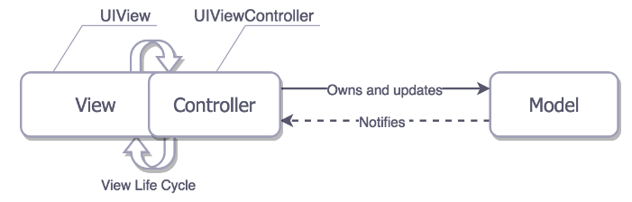
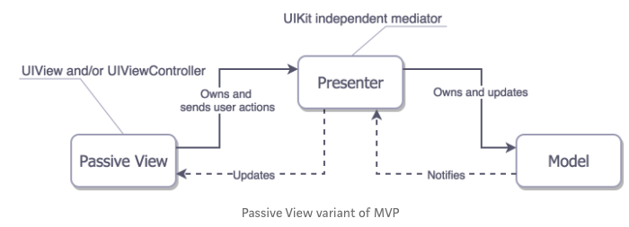
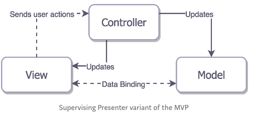
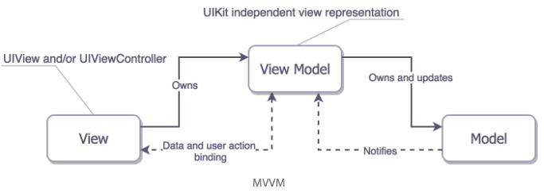
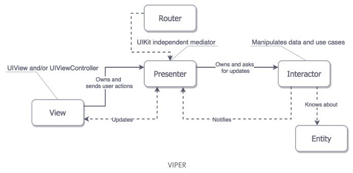

# [iOS Architecture Patterns](https://medium.com/ios-os-x-development/ios-architecture-patterns-ecba4c38de52)

### Why care about choosing architecture?

- Good architecture helps
    - Balance the distribution of responsibilities among different entities
        - Defeats complexity by dividing responsibilities
    - Testability
        - Helps unit tests
    - Maintainability
        - Less code means less bugs

### MV(X) essentials

- Models
    - Responsible for the domain data or data access layer which manipulates the data
- Views
    - Responsible for the presentation of the app
- Controller/Presenter/ViewModel
    - Mediator for the Model and View
    - Generally altering the Model by reacting to actions performed on the View and updating the View with changes from the Model

### MVC

- Realistic Cocoa MVC

    

    - View controller is very involved in the View's life cycle
    - View controller just ends up being a delegate and data source of everything
- Unit testing
    - Since the view controller is tightly coupled with the view, it is very hard to test just the business logic without also creating the view
- Assessment
    - Distribution
        - Positives: View and Model are decoupled
        - Negatives: View and Controller are tightly coupled
    - Testability
        - Only the model is really testable
    - Ease of use
        - Least amount of code among patterns

### MVP

- Benefits

    

    - The presenter has nothing to do with the life cycle of the view controller
    - View can be easily mocked because there is no layout code in the presenter
- Distinctions
    - The UIViewController subclasses are the Views
        - Provides testability
- Assessment
    - Distribution
        - Most of responsibilities divided between the Presenter and the Model
    - Testability
        - The View is pretty much a dummy so we can easily test business logic
    - Ease of use
        - Double the amount of code but easy to understand
- Variation
    - Supervising Controller MVP

        

        - Direct binding of the View and Model
        - The Presenter becomes the Supervising Controller
            - Handles actions from the View and is capable of changing the view
        - Cons
            - Vague responsibility separation
            - View and Model tightly coupled

### MVVM

- Similarities to MVP
    - Treats the view controller as the view
    - No tight coupling between view and model
- Additional features
    - Binding between the View and View Model
    - View Model
        - UIKit independent representation of your View and its state
        - Invokes changes in the Model and updates itself with the updated Model
        - Since binding exists between the View and View Model, the View is automatically updated
- Bindings
    - Through external functional reactive programming libraries like ReactiveCocoa, RxSwift, or PromiseKit
    - Reactive frameworks
        - Easy to mess things up when you go reactive
        - Looking through call stacks can be tiring
- Assessment
    - Distribution
        - View has more responsibilities
    - Testability
        - View Model knows nothing about the View
    - Ease of use
        - A good amount of code

### VIPER

- 5 layers
    - Interactor
        - Contains business logic related to the data(Entities) or networking
    - Presenter
        - Contains UI related business logic
        - Invokes methods on the Interactor
    - Entities
        - Plain data objects
        - Not the data access layer
            - That's reserved for the Interactor
    - Router
        - Responsible for segues between modules
- Differences between MV(X)
    - Data interaction logic shifted to the Interactor with Entities as dumb data structures
    - UI business logic of the view model moved into the Presenter
    - Navigation responsibility resolved by the Router
- Assessment
    - Distribution
        - More layers = better distribution
    - Testability
        - Better distribution = better testability
    - Ease of use
        - Huge amounts of interface for classes with small responsibilities
        - Costs maintainability

### Conclusion

- It's natural to have a mix of architectures in the same app
    - One screen may become too hard to maintain with MVC so you switch to MVVM
    - No need to refactor other screens that MVC does work fine, because both are compatible
